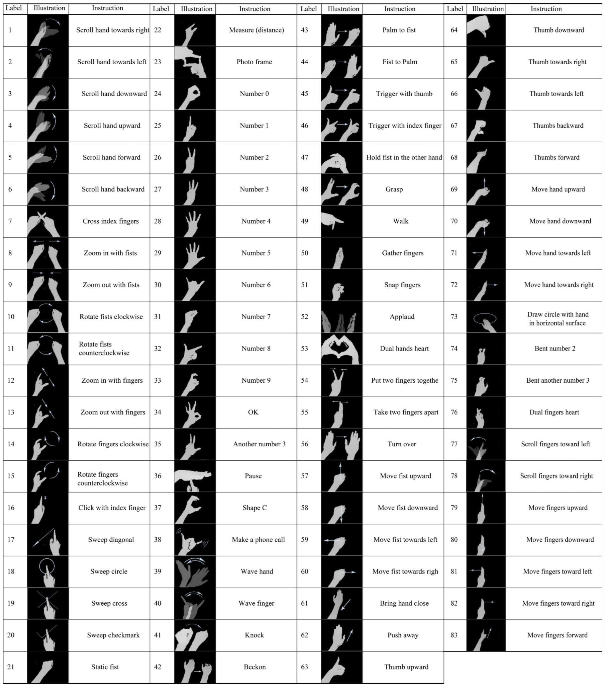

# Real-time Hand Gesture Recognition with RealSense D435 Depth Camera

## Egogesture



## Steps

* Install the requirements

  * [PyTorch](http://pytorch.org/)
  * Python 3

* Download pretrained models

  [Pretrained_models_v1 (1.08GB)](https://drive.google.com/file/d/11MJWXmFnx9shbVtsaP1V8ak_kADg0r7D/view?usp=sharing): The best performing models in [paper](https://arxiv.org/abs/1901.10323)

  [Pretrained_RGB_models_for_det_and_clf (371MB)(Google Drive)](https://drive.google.com/file/d/1V23zvjAKZr7FUOBLpgPZkpHGv8_D-cOs/view?usp=sharing)
  [Pretrained_RGB_models_for_det_and_clf (371MB)(Baidu Netdisk)](https://pan.baidu.com/s/114WKw0lxLfWMZA6SYSSJlw) -code:p1va

  [Pretrained_models_v2 (15.2GB)](https://drive.google.com/file/d/1rSWnzlOwGXjO_6C7U8eE6V43MlcnN6J_/view?usp=sharing): All models in [paper](https://ieeexplore.ieee.org/document/8982092) with efficient 3D-CNN Models

* Connect to RealSense D435 depth camera

* Run the code

  ```bash
  ./run_online_video_egogesture_depth.sh
  ```
